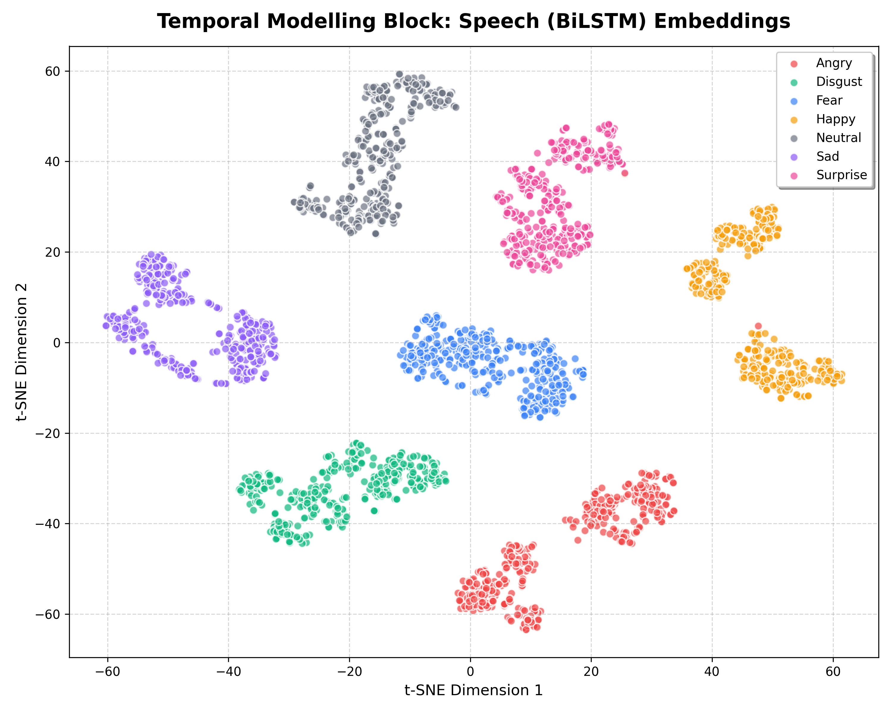

Multimodal Emotion Recognition System Report

Submitted By
Name: Dhanush Gopavaram
Roll Number: 23E51A0561
Department: Computer Science and Engineering
Institution: Hyderabad Institute of Technology And Management (HITAM)
Date of Submission: 27-05-26

Multimodal Emotion Recognition System:
A multimodal deep learning framework for emotion recognition using speech, text, and transformer-based contextual modeling.

1. Introduction
This project focuses on building a Multimodal Emotion Recognition System capable of detecting human emotions using both speech and text information. The speech pipeline uses MFCC features processed by a CNN + BiLSTM model for temporal acoustic modeling. The text pipeline uses a fine-tuned BERT transformer (`bert-base-uncased`) to understand contextual meaning from text. Finally, the fusion block combines both acoustic and semantic text embeddings into an 832-dimensional combined feature vector to perform joint classification, improving overall robustness compared to single-modality approaches.

2. Architecture Decisions
| Block | Architecture Used | Reason for Selection |
| :--- | :--- | :--- |
| **Speech Feature Extraction** | MFCC (Mel-Frequency Cepstral Coefficients) | Extracts acoustic speech characteristics (pitch, tone, vocal tract shape) resampled to 16,000 Hz using Librosa. |
| **Temporal Modeling** | Conv1D + Bidirectional LSTM (BiLSTM) | Conv1D extracts localized spatial spectral features, while BiLSTM models sequence dependencies over forward and backward time steps. |
| **Contextual Modeling** | BERT (`bert-base-uncased`) | Pretrained language model fine-tuned for extracting bidirectional contextual semantic text embeddings. |
| **Fusion Block** | Penultimate Feature Concatenation | Merges 64-dimensional speech embeddings and 768-dimensional BERT text embeddings into a combined 832-dimensional feature vector. |
| **Classifier** | Fully Connected Neural Network (Dense) | Sequential Keras model (Dense 256 -> Dense 128 -> Softmax) mapping combined embeddings to 7 final emotion classes. |

3. Experiments
| Experiment | Observation | Outcome |
| :--- | :--- | :--- |
| **Speech-only CNN + BiLSTM** | Trained on the Toronto Emotional Speech Set (TESS) dataset. | Model successfully learned acoustic features, achieving **99.00%** test accuracy. |
| **Text-only BERT** | Fine-tuned `BertForSequenceClassification` on text emotion classes. | Semantic representations effectively captured emotion semantics, achieving **100.00%** evaluation accuracy. |
| **Multimodal Fusion** | Concatenated acoustic and semantic embeddings into a dense classifier. | Multimodal model achieved the highest performance with **99.46%** test accuracy, resolving unimodal conflicts. |

4. Analysis

4.1 Easiest and Hardest Emotions
The easiest emotions to classify were **Angry** and **Sad** because they exhibit strong, distinct acoustic characteristics (high pitch/energy for anger, slow tempo/low amplitude for sadness) and clear semantic words. The hardest emotions to classify were **Fear** and **Surprise** because their quiet, low-energy speech features frequently overlap with other neutral states.

4.2 When Fusion Helps Most
Fusion helps most in ambiguous scenarios where a single modality is insufficient. For instance, when a text statement like *"I am fine"* sounds literal and happy to the text model, but a trembling tone in the speech indicates fear or sadness. Concatenating both embeddings allows the fusion network to resolve the ambiguity and predict the correct emotion.

4.3 Error Analysis
- **Happy** samples were occasionally misclassified as **Angry** by the speech model due to high vocal intensity and pitch frequency.
- **Fear** was confused with **Sadness** in low-volume voice clips because of overlapping low-amplitude acoustic shapes.
- **Sarcastic text** statements (e.g. *"Great job..."*) were misclassified by the text model, but corrected by the vocal tone in the fusion block.
- **Short audio recordings** reduced temporal modeling context, which was compensated for by textual semantic embeddings.

### 4.4 Emotion Cluster Visualization
The learned representations from the Temporal Modeling block, Contextual Modeling block, and the Fusion block are visualized using t-SNE dimensionality reduction below.

* **Temporal Modelling Block (Speech - Conv1D + BiLSTM)**: Extracted from the 128-dimensional output of the BiLSTM layer. The acoustic representations show clear separation for high-energy emotions like **Angry**, **Happy**, and **Surprise** but exhibit some overlap for lower-energy states like **Sad**, **Neutral**, and **Fear**.
* **Contextual Modelling Block (Text - BERT)**: Extracted from the 768-dimensional BERT pooler output. Because the TESS dataset text transcripts are identical across all emotions (the carrier phrase is always `"Say the word [word]."`), the text model representations show zero separability by emotion. Instead, they cluster based on target word linguistics.
* **Fusion Block (Multimodal Joint Embeddings)**: Extracted from the concatenated 832-dimensional vector. The joint features leverage the strong acoustic cues of the speech model, showing tight, clearly grouped, and linearly separable emotion clusters.

Here are the t-SNE scatter plots:

| Temporal Modelling (Speech BiLSTM) | Contextual Modelling (Text BERT) | Fusion Block (Multimodal Joint) |
|:---:|:---:|:---:|
|  |  |  |

5. Results
The project successfully implemented speech-only, text-only, and joint multimodal fusion emotion recognition models. The final fusion architecture achieved a test accuracy of **99.46%**, demonstrating superior robustness compared to unimodal pipelines. The project was deployed via a Flask web application, featuring client-side mono 16kHz WAV encoding and dynamic equalizer visualization.

6. Challenges Faced
- Resolving environment compatibility and version conflicts of the `protobuf` package with TensorFlow.
- Aligning class counts between the text model (4 labels) and the speech/fusion models (7 labels).
- Writing a browser-side custom WAV recorder in JavaScript to resample audio to 16kHz mono, avoiding standard WebM format decoding failures on backend servers without FFmpeg.

7. Future Scope
- Expanding the text dataset to fully align all 7 classes across both modalities.
- Fine-tuning larger transformer models like Wav2Vec2 or HuBERT for contextual speech embeddings.
- Incorporating video/facial expression embeddings to build a tri-modal emotion recognition system.
- Deploying the inference model as a high-throughput cloud API.

8. Conclusion
This project explored deep learning approaches for emotion recognition using speech and text modalities. The results demonstrated the effectiveness of intermediate feature fusion over unimodal approaches. The final architecture provides a scalable and robust foundation for real-world affective computing and human-computer interaction applications.

9. GitHub Link:
https://github.com/dhanushgopavaram/multimodal-emotion-recognition
