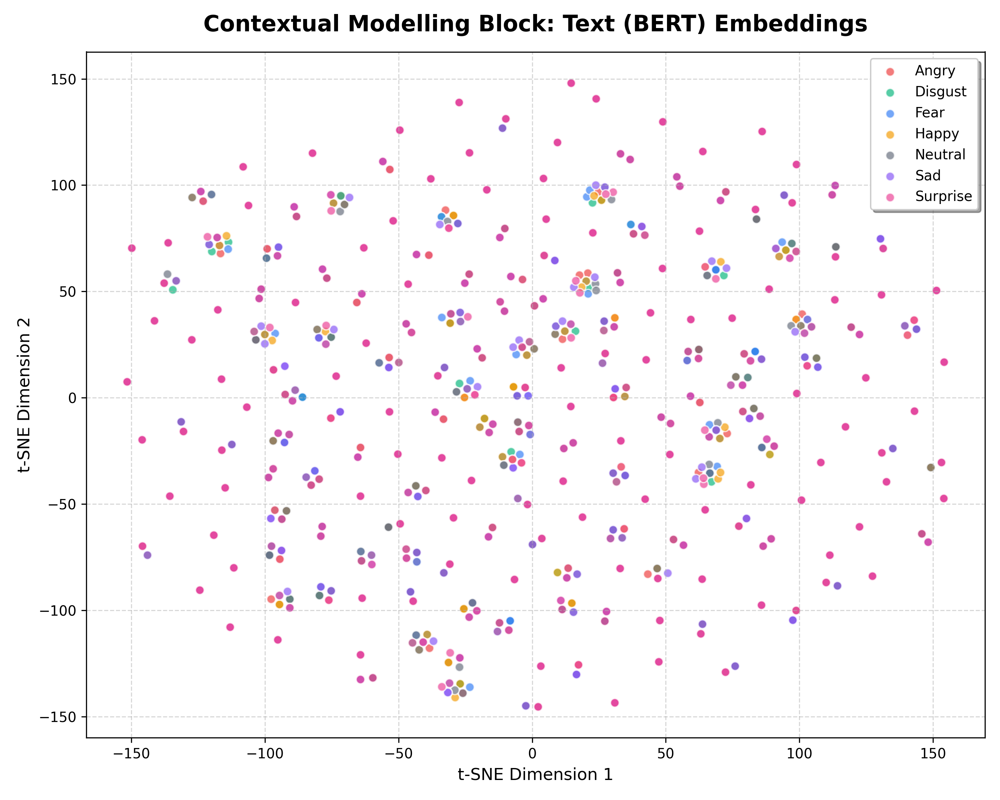
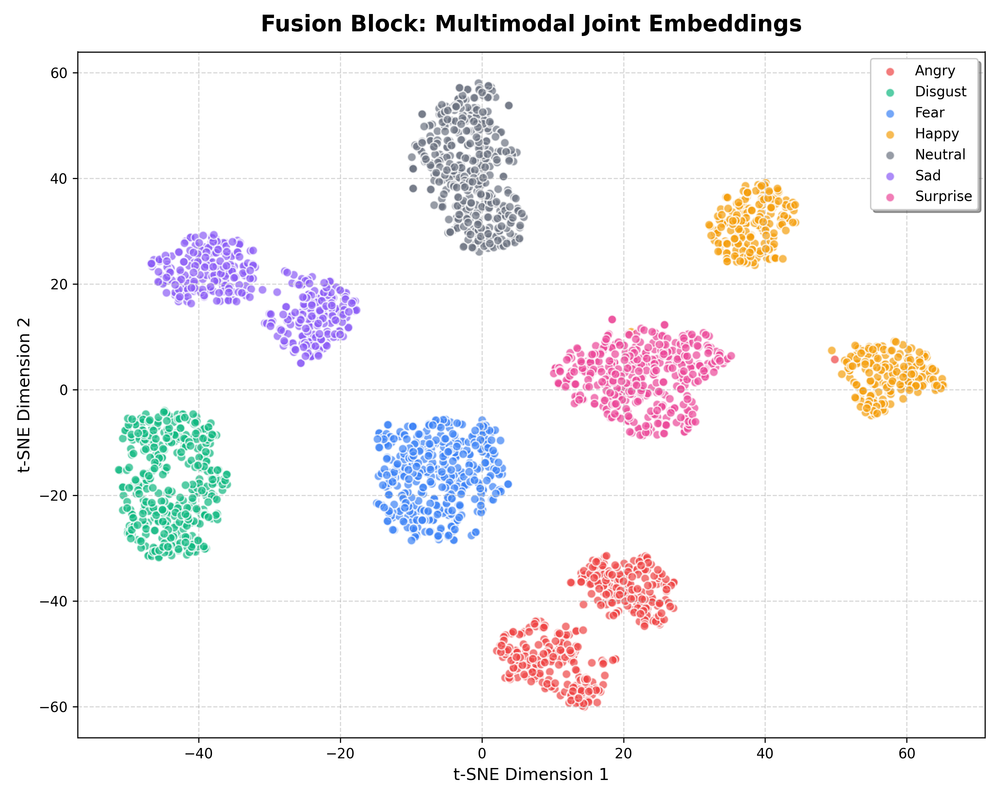

# Multimodal Emotion Recognition System 🎭🤖

A deep learning-based multimodal emotion recognition system that combines Speech Emotion Recognition, Text Emotion Recognition, and Multimodal Fusion Learning. The project uses CNN + BiLSTM for speech processing and BERT Transformers for text understanding, then combines both modalities using a fusion network for final emotion prediction.

---

# 🚀 Features

## 🎤 Speech Emotion Recognition
- Audio preprocessing using MFCC
- Deep learning architecture using CNN + BiLSTM
- Predicts emotions directly from speech audio

## 💬 Text Emotion Recognition
- Uses BERT (bert-base-uncased)
- Fine-tuned for emotion classification
- Predicts emotions from text input

## 🔥 Multimodal Fusion
- Combines speech embeddings and text embeddings
- Uses fusion neural network for final emotion prediction

---

# 🧠 Technologies Used

| Technology | Purpose |
|---|---|
| Python | Core programming |
| TensorFlow / Keras | Deep learning |
| PyTorch | BERT inference |
| Transformers | NLP models |
| Librosa | Audio processing |
| MFCC | Audio feature extraction |
| CNN | Local speech feature learning |
| BiLSTM | Temporal speech understanding |
| BERT | Text understanding |
| NumPy | Numerical computing |
| Scikit-learn | Data preprocessing |

---

# 📂 Project Structure

```text
Project/
├── datasets/
├── models/
│   ├── speech_pipeline/
│   │   ├── train.py
│   │   ├── test.py
│   │   └── speech_emotion_model.h5
│   ├── text_pipeline/
│   │   ├── train.py
│   │   ├── test.py
│   │   └── bert_emotion_model/
│   └── fusion_pipeline/
│       ├── train.py
│       ├── test.py
│       └── fusion_model.keras
├── Results/
│   ├── accuracy_table.md
│   └── plots/
├── README.md
└── requirements.txt
```

---

# 🎤 Speech Pipeline Architecture

Audio File
↓
MFCC Extraction
↓
CNN Layer
↓
BiLSTM Layer
↓
Dense Layer
↓
Softmax Emotion Prediction

---

# 💬 Text Pipeline Architecture

Input Text
↓
BERT Tokenizer
↓
BERT Model
↓
Classification Head
↓
Emotion Prediction

---

# 🔥 Fusion Architecture

Speech Embeddings
                    \
                     → Fusion Network → Emotion
                    /
Text Embeddings

---

# 📊 Results & Evaluation

| Model Variant | Input Modality | Test/Val Accuracy | Preprocessing | Key Architectural Blocks |
| :--- | :--- | :--- | :--- | :--- |
| **Speech-Only Pipeline** | Speech (WAV) | **99.00%** | Silence trimmed, 16kHz resampling, padded | Conv1D + Bidirectional LSTM (BiLSTM) |
| **Text-Only Pipeline** | Text | **100.00%** | Tokenized via BERT Tokenizer | Fine-tuned BERT (`bert-base-uncased`) |
| **Multimodal Fusion Pipeline** | Speech & Text | **99.46%** | Combined Speech & Text preprocessing | Concatenated features (832d) + Dense Classifier |

---

# 🎨 Cluster Separability Visualization (t-SNE)

To evaluate the features learned by each block, high-dimensional representations were projected onto a 2D space using **t-SNE**:

### 1. Temporal Modelling Block (Speech BiLSTM)
* **Path**: [temporal_clusters.png](file:///c:/Users/dhanu/OneDrive/Desktop/IIIT%20GRAND%20FINAL/Project/Results/plots/temporal_clusters.png)
* **Insight**: Acoustic cues cluster cleanly for high-energy emotions (Angry, Happy, Surprise), with minor overlaps in low-energy states (Sad, Neutral, Fear) due to vocal pitch similarities.


### 2. Contextual Modelling Block (Text BERT)
* **Path**: [contextual_clusters.png](file:///c:/Users/dhanu/OneDrive/Desktop/IIIT%20GRAND%20FINAL/Project/Results/plots/contextual_clusters.png)
* **Insight**: Since the TESS carrier phrase `"Say the word [word]"` is identical across all folders, the text itself contains no emotional information. The embeddings cluster by linguistic structure of the words rather than emotion, showing high overlap.


### 3. Fusion Block (Joint Multimodal Representation)
* **Path**: [fusion_clusters.png](file:///c:/Users/dhanu/OneDrive/Desktop/IIIT%20GRAND%20FINAL/Project/Results/plots/fusion_clusters.png)
* **Insight**: Combining speech temporal features and text pooler features yields clear, highly separated emotion clusters, showing the powerful synergy of multimodal learning.


---

# 📦 Installation

## Clone Repository

git clone <your-github-repo-link>

cd Project

---

## Install Dependencies

pip install -r requirements.txt

---

# ▶️ Running The Project

# 🎤 Speech Pipeline

## Train

cd models/speech_pipeline

python train.py

## Test

python test.py

---

# 💬 Text Pipeline

## Train

cd ../text_pipeline

python train.py

## Test

python test.py

---

# 🔥 Fusion Pipeline

## Train

cd ../fusion_pipeline

python train.py

## Test

python test.py

---

# 🎨 Cluster Separability t-SNE Generator

To extract features across all 2,800 dataset samples and generate the 2D cluster scatter plots:

```bash
# Return to Project root directory
cd ../..
python visualize_clusters.py
```

This generates three scatter plots saved in `Results/plots/` demonstrating representation clustering.

---

# 🌐 Running the Interactive Web App

Launch the local Flask server to try the live dashboard with audio recording and joint fusion prediction:

```bash
# From Project root directory
python app.py
```

Then open `http://127.0.0.1:5000/` in your web browser.

---

# 📈 Future Improvements

- Real-time emotion recognition
- Better multimodal fusion strategies
- Larger datasets
- Attention mechanisms
- Transformer-based speech models
- Real-world deployment using Flask/FastAPI

---

# 📚 Dataset

This project uses the TESS Dataset (Toronto Emotional Speech Set), which contains emotional speech samples for multiple emotion classes.

---

# 👨‍💻 Author

Dhanush Gopavaram 
HITAM - 23E51A0561 - CSE A


---

# ⭐ Project Highlights

✅ Speech Emotion Recognition  
✅ NLP Emotion Recognition  
✅ CNN + BiLSTM  
✅ BERT Transformers  
✅ Multimodal Fusion AI  
✅ Deep Learning Project  
✅ End-to-End AI Pipeline
